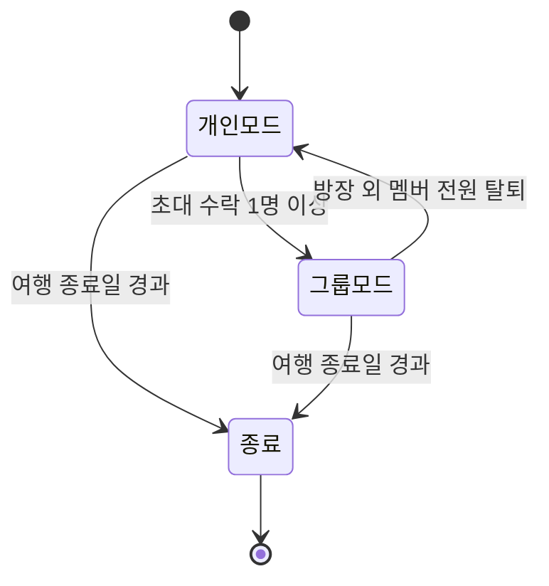
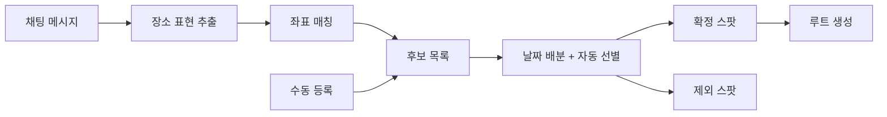

# Young Trip 기능명세서 v0.2

2026-09-19 · @한동관

## 문서 개요

이 문서는 여행계획 추천 앱의 개발 범위를 확정하기 위한 기능명세서다.

| 항목 | 내용 |
| --- | --- |
| 버전 | v0.2 |
| 작성일 | 2026-09-18 (v0.1) / 2026-09-19 (v0.2) |
| 목적 | 기능 확정 및 개발 착수 전 검토 |
| 포함 범위 | 기능 요구사항, 예외 처리, 비기능 요구사항, 릴리스 단계 |
| 제외 범위 | UI 디자인, 화면 설계서, API 명세, DB 스키마 |

v0.1의 미결정 9건 중 4건이 정해져 v0.2로 올렸다. 남은 항목은 문서 끝에 모았다.

## 서비스 개요

그룹 채팅에서 나온 "가고 싶은 곳"을 하나의 여행 루트로 자동 변환해 주는 앱이다.

| 항목 | 내용 |
| --- | --- |
| 타겟 사용자 | 2\~6인이 함께 국내·근거리 여행을 계획하는 20\~30대 |
| 핵심 차별점 1 | 대화 인식 — 채팅에서 장소를 추출해 후보와 루트를 자동 생성 |
| 핵심 차별점 2 | 자동 일기 — 여행 중 사진과 이동 기록을 날짜별 기록으로 정리 |
| 사용 단위 | 여행방 1개 = 여행 1건 |
| 서비스 지역 | 국내 전용. 해외는 로드맵 |

기존 여행 앱도 일정표와 지도는 제공한다. 이 앱의 존재 이유는 여러 명의 의견을 일정으로 바꾸는 과정을 자동화하는 데 있다. 대화 인식과 자동 일기를 뺀 나머지 기능은 시장에 이미 존재하므로, 개발 자원은 이 두 개에 집중한다.

## 용어 정의

문서 전반에서 아래 의미로만 쓴다.

| 용어 | 정의 |
| --- | --- |
| 여행방 | 여행 1건을 담는 기본 단위. 개인 모드로 생성된다 |
| 그룹방 | 초대 수락으로 2인 이상이 된 여행방. 채팅이 활성화된다 |
| 게스트 | 회원가입 없이 기기 토큰과 닉네임만으로 참여하는 사용자 |
| 스팟 | 루트를 구성하는 개별 방문 장소 |
| 후보 | 채팅 또는 수동 등록으로 모인 방문 희망 장소. 전부 루트 생성 대상이 된다 |
| 확정 스팟 | 날짜 배분을 통과해 루트에 자리를 잡은 후보 |
| 제외 스팟 | 시간이 부족해 루트에서 빠진 후보. 목록에 남고 수동으로 되돌릴 수 있다 |
| 고정 | 자동 제외 대상에서 빼는 표시. 고정한 후보는 자동으로 빠지지 않는다 |
| 제안자 | 해당 스팟을 채팅에서 언급했거나 직접 등록한 사용자 |
| 기점 | 하루 루트가 시작하고 끝나는 지점. 숙소 또는 사용자가 지정한 장소 |
| 루트 | 하루 단위로 정렬된 스팟 순서와 구간별 이동 경로 |
| 시간표 | 각 스팟의 도착·체류·출발 시각이 붙은 루트 |
| 지연 | 현재 위치 기준 도착 예정 시각이 계획보다 15분 이상 늦은 상태 |
| 조정안 | 지연 발생 시 앱이 제안하는 순서 변경 또는 스팟 제외 제안 |
| 일기 | 사진·방문 기록·시각을 묶어 자동 생성한 하루 단위 기록 |

## 사용자 유형 및 권한

방장은 여행방을 만든 사람이고, 그룹원은 초대로 합류한 사람이다. 게스트와 정식 계정의 권한은 같다.

| 동작 | 개인 사용자 | 방장 | 그룹원 |
| --- | --- | --- | --- |
| 여행방 생성 | O | O | X |
| 멤버 초대 | O | O | X |
| 멤버 내보내기 | — | O | X |
| 스팟 제안·등록 | O | O | O |
| 스팟 고정·삭제 | O | O | O |
| 기점 등록·변경 | O | O | O |
| 일정 시각 수정 | O | O | O |
| 루트 재생성 | O | O | O |
| 사진 업로드·일기 열람 | O | O | O |
| 여행방 삭제 | O | O | X (나가기만 가능) |

확정은 시스템이 한다. 사람이 하는 조작은 고정과 삭제뿐이므로 확정 권한 행이 사라졌다. 근거는 FR-403을 참조한다.

## 기능 목록 요약

기능 ID는 FR-백단위 그룹 + 일련번호로 부여한다. 번호는 추가된 순서이며 실행 순서와 다를 수 있다.

| ID | 기능명 | 우선순위 |
| --- | --- | --- |
| FR-105 | 게스트 세션 | MVP |
| FR-101 | 이메일 회원가입 | 2차 |
| FR-102 | 로그인·로그아웃 | 2차 |
| FR-103 | 소셜 로그인 | 2차 |
| FR-104 | 프로필 관리 | 2차 |
| FR-201 | 여행방 생성 | MVP |
| FR-202 | 스팟 수동 등록 | MVP |
| FR-203 | 여행방 목록 | MVP |
| FR-204 | 여행방 삭제·나가기 | MVP |
| FR-205 | 기점 등록 | MVP |
| FR-301 | 초대 링크 발급 | MVP |
| FR-302 | 초대 수락 및 그룹 전환 | MVP |
| FR-303 | 멤버 관리 | 2차 |
| FR-304 | 그룹 채팅 | MVP |
| FR-401 | 채팅 장소 추출 | MVP |
| FR-402 | 후보 목록 | MVP |
| FR-403 | 후보 자동 선별 | MVP |
| FR-404 | 여행지 추천 | 2차 |
| FR-505 | 스팟 날짜 배분 | MVP |
| FR-501 | 루트 순서 최적화 | MVP |
| FR-502 | 시간표 생성 | MVP |
| FR-503 | 일정 수동 편집 | MVP |
| FR-504 | 이동수단 선택 | MVP (도보·자동차) / 2차 (대중교통) |
| FR-601 | 현재 위치 표시 | 2차 |
| FR-602 | 도착 감지 | 2차 |
| FR-603 | 지연 감지 및 일정 재계산 | 2차 |
| FR-604 | 빈 시간 추천 | 3차 |
| FR-701 | 사진 업로드 | 3차 |
| FR-702 | 자동 일기 생성 | 3차 |
| FR-703 | 일기 편집·공유 | 3차 |
| FR-704 | 이동 경로 기록 | 3차 |
| FR-801 | 스팟 마커 표시 | MVP |
| FR-802 | 루트 라인 표시 | MVP |
| FR-803 | 스팟 상세 | MVP |
| FR-804 | 실제 이동 경로 표시 | 3차 |

## FR-100 계정 및 프로필

1단계는 게스트 세션만으로 돌아간다. 회원가입과 로그인은 2차다.

| ID | 기능명 | 설명 | 입력 | 출력 | 예외 처리 |
| --- | --- | --- | --- | --- | --- |
| FR-105 | 게스트 세션 | 회원가입 없이 기기 토큰과 닉네임으로 사용자를 만든다 | 닉네임 | 게스트 사용자 ID, 기기 토큰 | 토큰 분실 시 복구 불가 안내 / 토큰 유효기간 30일, 사용할 때마다 갱신 / 같은 기기에서 재실행 시 기존 세션 복원 |
| FR-101 | 이메일 회원가입 | 이메일과 비밀번호로 계정을 만든다 | 이메일, 비밀번호, 닉네임 | 계정 생성, 인증 메일 발송 | 중복 이메일 거부 / 비밀번호 규칙 위반 안내 / 인증 메일 재발송 |
| FR-102 | 로그인·로그아웃 | 인증 후 세션 토큰을 발급한다 | 이메일, 비밀번호 | 액세스 토큰, 사용자 정보 | 계정 기준 5회 오류 시 10분 잠금 / 같은 IP·기기 기준 시도 제한 병행 / 미인증 계정 차단 |
| FR-103 | 소셜 로그인 | 카카오·구글 계정으로 가입·로그인한다 | OAuth 인증 코드 | 액세스 토큰 | 동일 이메일 계정 존재 시 연동 여부 확인 / 제공자 응답 실패 |
| FR-104 | 프로필 관리 | 닉네임, 이미지, 여행 성향 태그를 설정한다 | 닉네임, 이미지 파일, 태그 선택 | 저장된 프로필 | 닉네임 중복 / 이미지 5MB 초과 시 압축 |

게스트 세션을 넣은 이유는 이렇다. 1단계 완료 기준이 "3명이 채팅으로 장소를 말하면 루트가 나온다"이므로 초대와 그룹 채팅이 1단계에 있어야 한다. 그런데 계정이 없으면 사용자를 식별할 방법이 없다. 기기 토큰 기반 게스트가 회원가입 화면 없이 식별 문제만 푸는 최소 수단이다.

게스트의 한계는 명확히 안내한다. 기기를 바꾸거나 앱을 지우면 여행방에 다시 들어갈 수 없다. 2차에서 게스트를 정식 계정으로 승격하는 경로를 붙인다. 승격 시 이관할 데이터 범위는 미결정 사항에 있다.

여행 성향 태그(맛집, 자연, 액티비티, 휴식 등)는 FR-404 추천의 입력값이다. FR-104와 FR-404가 모두 2차이므로 함께 움직인다.

## FR-200 여행 생성 및 개인 모드

모든 여행은 개인 모드로 시작하고, 초대가 수락되는 순간 그룹 모드로 바뀐다.

| ID | 기능명 | 설명 | 입력 | 출력 | 예외 처리 |
| --- | --- | --- | --- | --- | --- |
| FR-201 | 여행방 생성 | 제목, 목적지, 시작일·종료일로 여행방을 만든다 | 제목, 지역, 날짜 범위 | 여행방 ID, 빈 일정 | 종료일이 시작일보다 빠름 / 기간 14일 초과 시 확인 / 국내 지역만 선택 가능 |
| FR-202 | 스팟 수동 등록 | 가고 싶은 장소를 검색해 후보에 담는다 | 검색어 또는 지도 선택 | 스팟(이름, 좌표, 카테고리) | 검색 결과 없음 / 목적지 밖 장소는 확인 후 등록 |
| FR-203 | 여행방 목록 | 참여 중인 여행을 예정·진행중·완료로 나눠 보여준다 | 없음 | 상태별 여행방 목록 | 여행방이 없을 때 생성 유도 화면 |
| FR-204 | 여행방 삭제·나가기 | 방장은 삭제, 그룹원은 나가기를 한다 | 여행방 ID | 삭제 또는 탈퇴 처리 | 삭제 전 확인 1회 / 방장 탈퇴 시 위임 대상 지정(미결정) |
| FR-205 | 기점 등록 | 날짜별 출발·복귀 지점(숙소 등)을 지정한다 | 여행방 ID, 날짜, 장소 | 날짜별 기점 좌표 | 미지정 시 그날 첫 스팟을 기점으로 사용 / 해당 날짜 미지정 시 직전 날짜 기점 승계 / 복귀 지점 없음 선택 가능 |

기점은 FR-501 루트 순서 최적화의 출발 좌표다. 기점이 없으면 순서를 정할 기준점이 없으므로 MVP에 넣는다.

개인 모드에서도 FR-500 루트 생성과 FR-800 지도는 그대로 동작한다. 그룹 전용 기능은 채팅과 대화 인식뿐이다.

## FR-300 그룹

초대 링크를 처음 수락한 사람이 생기는 시점에 개인 여행방이 그룹방으로 전환된다.

그룹모드에서 개인모드로 돌아가더라도 그동안 쌓인 채팅과 스팟은 유지한다. 종료 상태에서도 FR-700 일기와 FR-800 지도는 열람할 수 있다. 종료는 편집 잠금이지 삭제가 아니다.

| ID | 기능명 | 설명 | 입력 | 출력 | 예외 처리 |
| --- | --- | --- | --- | --- | --- |
| FR-301 | 초대 링크 발급 | 유효기간이 있는 초대 링크를 만든다 | 여행방 ID | 초대 URL(기본 7일 유효) | 만료 링크 안내 / 정원 6명 초과 / 링크 무효화 후 재발급 가능 |
| FR-302 | 초대 수락 및 그룹 전환 | 수락 시 그룹방을 생성하고 기존 스팟을 승계한다 | 초대 URL, 게스트 또는 계정 | 그룹방, 멤버 목록, 채팅 활성화 | 세션 없음 → 닉네임 입력 후 게스트로 합류 / 이미 참여한 사용자 |
| FR-303 | 멤버 관리 | 방장이 멤버를 내보내거나 권한을 조정한다 | 멤버 ID, 동작 | 갱신된 멤버 목록 | 방장 본인 강퇴 불가 / 방장 외 멤버가 전원 나가면 개인 모드로 전환 |
| FR-304 | 그룹 채팅 | 여행방 안에서 실시간 채팅을 한다 | 메시지 텍스트 | 저장·전송된 메시지 | 네트워크 끊김 시 재전송 큐 / 순서 보정 |

여행방 정원은 6명이다. 타겟 사용자 규모와 같은 값이며 FR-301에서 강제한다.

초대 링크는 링크를 가진 사람이면 누구나 합류한다. 게스트 합류를 허용하면 진입 장벽이 사라지는 대신 아무나 들어올 수 있다. 방장 승인 단계를 둘지는 미결정 사항에 있다.

FR-303은 2차다. 내보내기 없이도 1단계 검증은 된다. 강퇴 시 그 멤버가 제안한 스팟과 채팅을 어떻게 처리할지까지 정해야 해서 범위가 커진다.

채팅은 FR-401 장소 추출의 유일한 입력원이다. 채팅이 없으면 대화 인식 기능 전체가 동작하지 않는다.

## FR-400 여행지 추천 및 대화 인식

채팅 메시지에서 장소를 뽑아 후보에 쌓는다. 후보는 전부 루트 생성 대상이 되고, 시간이 부족한 만큼만 자동으로 빠진다.

| ID | 기능명 | 설명 | 입력 | 출력 | 예외 처리 |
| --- | --- | --- | --- | --- | --- |
| FR-401 | 채팅 장소 추출 | 메시지에서 장소로 보이는 표현을 찾아 좌표와 함께 후보로 등록한다 | 채팅 메시지, 목적지 지역 | 장소명, 좌표, 카테고리, 제안자 | 인식 실패 시 후보를 만들지 않고 화면에도 표시하지 않음 / 동명 장소 다수 → 사용자 선택 / 목적지 밖 장소 제외 / 오인식 후보는 사용자가 삭제 |
| FR-402 | 후보 목록 | 후보를 제안자 수와 함께 보여주고, 확정·제외 상태를 구분한다 | 여행방 ID | 후보 목록(장소, 제안자 수, 상태) | 중복 장소는 하나로 합치고 제안자만 누적 / 제외 스팟은 별도 구역에 표시하고 고정으로 되돌릴 수 있음 |
| FR-403 | 후보 자동 선별 | 후보 전부를 루트 대상으로 넣고, 하루 수용량을 넘는 만큼만 자동으로 뺀다 | 후보 목록, 날짜별 수용량 | 확정 스팟, 제외 스팟 | 제외 순서는 제안자 수가 적은 순 / 동점이면 등록이 늦은 순 / 고정한 후보는 제외 대상에서 빠짐 / 고정만으로 수용량을 넘기면 초과분을 안내하고 사용자가 직접 뺀다 |
| FR-404 | 여행지 추천 | 목적지, 기간, 성향 태그, 확정 스팟을 기준으로 추가 장소를 제안한다 | 지역, 기간, 태그, 기존 스팟 | 추천 장소 3\~5개 | 추천 데이터 부족 시 인기 장소로 대체 |

FR-403은 확정 버튼이 없는 설계다. 투표 화면, 집계, 마감 시점, 동점 처리가 전부 사라진다. 제안자 수는 FR-402가 이미 누적하고 있으므로 새 데이터도 필요 없다. 사용자가 개입하는 지점은 고정과 삭제 두 가지뿐이다.

제외는 숨기지 않는다. 빠진 스팟과 빠진 이유를 목록에 남겨야 사용자가 고정으로 되돌릴 수 있다. 조용히 사라지면 "내가 말한 데가 없어졌다"가 되고, 이 기능의 신뢰가 무너진다.

선별은 FR-505 날짜 배분 안에서 실행된다. 수용량이 배분 결과로 나오기 때문이다. 정책과 계산을 분리해 적었을 뿐 별도 단계가 아니다.

수동 등록(FR-202)은 목적지 밖 장소도 확인 후 허용하고, 자동 추출(FR-401)은 제외한다. 기준이 다른 것은 의도한 것이다. 수동 등록은 사용자가 그 장소를 직접 고른 것이고, 자동 추출에서 목적지 밖 좌표는 대부분 동명 지명 오인식이기 때문이다.

추출 정확도가 이 앱의 체감 품질을 좌우한다. "거기 그 카페" 같은 지시 표현은 인식 대상에서 제외하고, 실패했을 때 사용자가 직접 등록하는 경로(FR-202)를 항상 열어둔다. 목표 수치는 비기능 요구사항의 추출 품질 항목에 둔다.

## FR-500 루트 생성 및 일정

후보를 날짜별로 나누고 이동 시간을 계산해 시간표를 만든다. 실행 순서는 FR-505, FR-501, FR-502 순이다.

| ID | 기능명 | 설명 | 입력 | 출력 | 예외 처리 |
| --- | --- | --- | --- | --- | --- |
| FR-505 | 스팟 날짜 배분 | 후보를 여행 일자에 나눈다. 지역 근접도와 하루 활동시간이 기준이며, 초과분은 FR-403 규칙으로 뺀다 | 후보, 날짜 범위, 날짜별 기점 | 날짜별 확정 스팟, 제외 스팟 | 하루 수용량 초과 시 다음 날로 이월 / 전 일자 초과 시 FR-403 순서로 제외 / 사용자가 날짜를 직접 지정한 스팟은 고정 취급 |
| FR-501 | 루트 순서 최적화 | 하루치 스팟을 이동 시간이 짧은 순서로 정렬한다 | 그날 스팟, 기점, 이동수단 | 정렬된 순서, 구간별 이동 시간 | 스팟 10개 초과 시 근사 정렬 / 경로 API 실패 시 직선거리 기준 |
| FR-502 | 시간표 생성 | 각 스팟의 도착·출발 시각과 체류 시간을 계산한다 | 정렬된 루트, 시작 시각, 기본 체류시간 | 시간표(도착·체류·출발·이동) | 영업시간 밖 배치 시 안내 / 하루 활동시간 초과 시 다음 날 이월 제안 |
| FR-503 | 일정 수동 편집 | 스팟 순서, 시각, 체류 시간, 배정 날짜를 직접 바꾼다 | 변경할 스팟, 새 값 | 갱신된 시간표 | 편집 후 뒤 일정 자동 재계산 / 그룹 동시 편집 시 나중 저장 우선 |
| FR-504 | 이동수단 선택 | 1단계는 도보와 자동차 중 선택한다. 대중교통은 2차에 더한다 | 이동수단 | 수단별 경로와 소요 시간 | 해당 수단 경로 없음 → 대체 수단 안내 / 자동차 경로 실패 시 도보로 대체 계산 |

FR-505가 없으면 FR-501은 "하루치 스팟"을 받을 수 없다. 후보 전체를 며칠에 어떻게 나눌지 정하는 기능이므로 MVP에 넣는다.

FR-504가 MVP로 올라온 이유는 이동수단이 하루 수용량을 바꾸기 때문이다. 도보만 쓰면 하루에 3곳, 자동차를 쓰면 6곳이 들어간다. 수단이 정해지지 않으면 FR-505의 수용량 계산이 성립하지 않는다. 1단계 범위는 도보와 자동차이며, 둘 다 좌표 간 단순 경로 조회로 끝난다. 대중교통은 환승과 배차 시간표가 필요해 2차로 미룬다.

체류 시간 기본값은 카테고리별로 둔다.

| 카테고리 | 기본 체류 시간 |
| --- | --- |
| 식당 | 60분 |
| 카페 | 40분 |
| 관광지·전시 | 90분 |
| 쇼핑 | 60분 |
| 산책·공원 | 45분 |

사용자가 값을 바꾸면 그 값을 우선한다. 하루 기본 활동시간은 09:00\~21:00으로 잡는다. FR-505의 하루 수용량은 이 활동시간에서 이동 시간을 뺀 값으로 계산한다.

## FR-600 실시간 진행 관리

위치 기반 기능은 앱이 화면에 떠 있을 때를 기준으로 설계한다. 백그라운드 상시 추적은 배터리 소모와 OS 제약 때문에 범위에서 제외한다.

| ID | 기능명 | 설명 | 입력 | 출력 | 예외 처리 |
| --- | --- | --- | --- | --- | --- |
| FR-601 | 현재 위치 표시 | 지도 위에 사용자 현재 위치를 표시한다 | GPS 좌표 | 현재 위치 마커 | 위치 권한 거부 → 수동 진행 모드 / GPS 음영 지역 안내 |
| FR-602 | 도착 감지 | 정확도 50m 이하 GPS 샘플 기준으로, 스팟 반경 100m 안에서 3분 이상 머물면 도착으로 처리한다 | GPS 좌표, 정확도, 스팟 좌표 | 도착 시각 기록, 다음 일정 활성화 | 정확도 50m 초과 샘플은 판정에서 제외 / 오탐 시 수동 취소 / 도착 안 했지만 지나간 경우 건너뜀 처리 |
| FR-603 | 지연 감지 및 일정 재계산 | 도착 예정 시각이 15분 이상 늦어지면 뒤 일정을 다시 계산해 제안한다 | 현재 위치, 남은 루트 | 조정안(순서 변경 또는 스팟 제외) | 영업 종료로 방문 불가한 스팟이 제외 1순위 / 그다음은 FR-403과 같은 순서 / 사용자 거절 시 원래 일정 유지 |
| FR-604 | 빈 시간 추천 | 다음 일정까지 30분 이상 남으면 주변에서 할 일을 제안한다 | 현재 위치, 남은 시간 | 도보 이동 가능한 장소 2\~3개 | 주변 결과 없음 → 추천 생략 |

판정 반경과 허용 오차가 같으면 옆 건물에서도 도착으로 잡힌다. 반경은 100m로 두되 판정에 쓰는 샘플의 정확도를 50m 이하로 제한한다.

알림은 조정안 제안 형태로만 보낸다. "늦었습니다" 식의 경고는 여행 중 스트레스를 키우고 알림 차단으로 이어지므로 쓰지 않는다. 동일 상황 알림은 30분에 1회로 제한한다.

## FR-700 기록 및 일기

여행이 끝나면 사진과 방문 기록을 날짜별 일기로 자동 정리한다.

| ID | 기능명 | 설명 | 입력 | 출력 | 예외 처리 |
| --- | --- | --- | --- | --- | --- |
| FR-701 | 사진 업로드 | 여행 중 사진을 여행방에 올린다 | 이미지 파일 | 저장된 사진, 촬영 시각·위치(EXIF) | EXIF 없음 → 업로드 시각과 당시 일정으로 추정 / 장당 10MB 초과 시 압축 |
| FR-702 | 자동 일기 생성 | 사진, 방문 스팟, 시각을 묶어 하루 단위 일기를 만든다 | 날짜, 사진 목록, 방문 기록 | 시간순 일기(사진 + 장소 + 설명문) | 사진 0장 → 방문 기록만으로 생성 / 생성 실패 시 빈 일기 제공 |
| FR-703 | 일기 편집·공유 | 자동 생성된 문장을 고치고 그룹원과 공유한다 | 수정 텍스트 | 저장된 일기 | 동시 편집은 나중 저장 우선(FR-503과 같은 정책) / 탈퇴한 멤버의 사진 처리 정책 필요 |
| FR-704 | 이동 경로 기록 | 방문한 스팟과 이동 구간을 좌표로 저장한다 | 도착 기록, 위치 로그 | 날짜별 경로 데이터 | 위치 권한 거부 시 도착 지점만 연결 |

동시 편집 충돌은 일정과 일기 모두 나중 저장 우선으로 통일한다. 정책을 둘로 나누면 구현과 사용자 설명이 같이 갈라진다.

경로 기록의 1차 구현은 스팟 도착 지점을 순서대로 잇는 방식이다. 초 단위 이동 궤적 추적은 배터리 문제가 해결된 뒤에 검토한다. 사진의 EXIF 위치를 쓰면 상시 추적 없이도 경로의 상당 부분을 복원할 수 있다.

## FR-800 지도

계획 화면과 기록 화면은 같은 지도 컴포넌트를 공유한다.

| ID | 기능명 | 설명 | 입력 | 출력 | 예외 처리 |
| --- | --- | --- | --- | --- | --- |
| FR-801 | 스팟 마커 표시 | 확정 스팟과 제외 스팟을 구분해 지도에 표시한다 | 스팟 목록 | 마커(확정·제외 구분, 방문 순번 표시) | 마커 밀집 시 클러스터링 |
| FR-802 | 루트 라인 표시 | 확정된 방문 순서를 선으로 잇는다 | 정렬된 루트 | 날짜별 색상의 경로 선 | 경로 API 실패 시 직선으로 대체 표시 |
| FR-803 | 스팟 상세 | 마커를 누르면 장소 정보와 도착 예정 시각을 보여준다 | 스팟 ID | 이름, 주소, 예정 시각, 제안자 | 정보 없는 항목은 표시 생략 |
| FR-804 | 실제 이동 경로 표시 | 실제 이동한 지점을 점으로 찍어 계획 루트와 겹쳐 보여준다 | 경로 기록 | 실제 경로 점 + 계획 루트 선 | 기록 없는 구간은 점선 처리 |

좌표는 WGS84를 쓴다. 국내 전용으로 확정했으므로 지도 SDK는 카카오맵 또는 네이버지도 중 하나만 쓴다. 두 벌을 유지하지 않는다.

해외는 로드맵에 남겼다. 나중에 구글맵을 붙일 수 있도록 장소 검색, 좌표 매칭, 경로 조회를 SDK 중립 인터페이스로 감싼다. 이 추상화 비용은 1단계에서 지불한다. 나중에 걷어내는 것보다 싸다.

## 비기능 요구사항

아래 수치는 초안 기준값이며 테스트 후 조정한다.

| 항목 | 요구사항 |
| --- | --- |
| 성능 | 루트 재계산 3초 이내, 지도 초기 로딩 2초 이내 |
| 추출 품질 | 명시적 장소명 재현율 80% 이상, 오탐율 10% 이하. 미달이면 1단계 통과로 보지 않는다 |
| 선별 품질 | 자동 제외된 스팟은 제외 이유와 함께 100% 표시한다. 조용한 제외는 없다 |
| 외부 API 비용 | 루트 재계산 1회당 경로 API 호출 100회 이하. 동일 구간 결과는 24시간 캐시 |
| 위치 정확도 | 도착 판정에 정확도 50m 이하 샘플만 사용. 판정 반경 100m |
| 배터리 | 여행 진행 중 위치 갱신 30초 간격, 정지 상태에서는 갱신 중단 |
| 백그라운드 | 상시 추적 미지원. 앱이 꺼진 동안의 경로는 복원하지 않는다 |
| 오프라인 | 확정 일정과 스팟 좌표는 단말에 캐시해 네트워크 없이 열람 가능. 재계산·추천은 온라인 필요 |
| 개인정보 | 위치 이력은 여행 종료 후 90일 보관 뒤 삭제. 그룹원 간 실시간 위치 공유는 기본 꺼짐 |
| 데이터 보존 | 여행방·채팅·사진은 여행 종료 후 1년 보관. 계정 탈퇴 시 본인 업로드 사진은 삭제하고, 채팅과 제안 이력은 익명 처리 후 유지 |
| 알림 | 동일 유형 30분 1회 제한, 유형별로 끄기 가능 |
| 보안 | 게스트 기기 토큰은 추측 불가능한 난수, 유효기간 30일. 비밀번호 해시 저장, 토큰 만료 관리, 난수 초대 링크, 계정·IP 이중 로그인 시도 제한 |
| 서비스 지역 | 국내 전용. 지도 SDK 1종. 외부 의존은 SDK 중립 인터페이스로 감싼다 |
| 지원 환경 | 모바일 웹 우선, iOS·안드로이드 최신 2개 버전 |

경로 API 호출량은 스팟 N개에 대해 구간 조합이 N²로 늘어난다. 스팟 10개면 재계산 1회에 최대 90구간이다. 호출 상한과 캐시를 비기능 요구사항으로 못 박아야 FR-501과 FR-505의 알고리즘을 고를 수 있다. 1단계 이동수단이 도보와 자동차뿐이라 수단별 호출이 2배가 된다는 점도 예산에 넣는다.

위치 권한을 거부한 사용자도 계획 수립과 일정 열람은 전부 쓸 수 있어야 한다. 위치 기반 기능은 부가 기능으로 분리한다.

## 결정 완료

v0.1의 미결정 중 아래 4건이 정해졌다.

| 항목 | 결정 | 영향 |
| --- | --- | --- |
| 의견 충돌 처리 방식 | 후보 전부 포함 후 하루 수용량 초과분만 자동 제외. 순서는 제안자 수가 적은 순, 동점이면 등록이 늦은 순 | FR-403 재정의, 권한표에서 확정 권한 삭제, 용어 정의에 제외·고정 추가 |
| 이동수단 범위 | 1단계 도보·자동차, 2차 대중교통 | FR-504 MVP 승격. 하루 수용량 계산의 전제 |
| 해외여행 지원 | 국내 먼저, 해외는 로드맵 | 지도 SDK 1종. 외부 의존을 중립 인터페이스로 감쌈 |
| 1단계 범위 | 회원가입·로그인을 2차로, 게스트 세션으로 대체 | FR-105 신설, FR-101\~104 2차 이동 |

## 미결정 사항

- [ ] **경로 API 제공자와 월 호출 예산** — FR-501·FR-505의 알고리즘 상한을 결정한다. 1단계 착수 전에 필요하다
- [ ] 게스트 → 정식 계정 승격 시 이관 범위 — 여행방, 채팅 발언, 제안 이력, 사진 중 무엇을 옮길지
- [ ] 초대 링크 합류에 방장 승인 단계를 둘지 — 게스트 합류를 허용하면서 더 중요해졌다
- [ ] 그룹원 간 실시간 위치 공유 허용 여부
- [ ] 방장 권한 위임 — 방장이 나갈 때의 처리
- [ ] 예산·정산 기능 포함 여부 — 현재는 제외를 전제로 작성했다
- [ ] 사진 저장 위치와 용량 정책 — 서버 저장 시 비용이 가장 큰 항목이 된다

첫 번째 항목이 가장 급하다. 경로 API 단가와 쿼터를 모르면 FR-501의 정렬 알고리즘과 FR-505의 수용량 계산 방식을 고를 수 없다.

## 릴리스 범위

1단계는 "대화에서 루트가 나온다"만 검증한다. 계정, 위치, 기록은 그 다음이다.

| 단계 | 포함 기능 | 완료 기준 |
| --- | --- | --- |
| 1단계 (MVP) | FR-105, 201\~205, 301·302·304, 401\~403, 501\~505, 801\~803 | 게스트 3명이 초대 링크로 모여 채팅으로 장소를 말하면 날짜별 일정표와 지도 루트가 나온다 |
| 2단계 | FR-101\~104, 303, 404, 601\~603, FR-504 대중교통 확장, 게스트 계정 승격 | 계정으로 여행방을 이어 쓰고, 여행 당일 현재 위치가 뜨고, 늦으면 조정안이 제안된다 |
| 3단계 | FR-604, 701\~704, 804 | 여행 후 사진과 경로가 하루 단위 일기로 자동 정리된다 |
| 로드맵 | 해외여행 지원 | 구글맵 병행. 1단계에서 만든 중립 인터페이스에 구현체만 추가한다 |

1단계 기능은 16개다. 회원가입·로그인 3개가 빠지고 게스트 세션과 이동수단 선택이 들어왔다. 그룹 채팅 실시간 동기화, 장소 추출, 경로 계산 세 가지 어려운 문제는 그대로 남아 있다. 이 중 하나라도 막히면 2단계로 넘어가지 않는다.

## 변경 이력

| 일자 | 버전 | 내용 |
| --- | --- | --- |
| 2026-09-18 | v0.1 | 초안 작성 |
| 2026-09-18 | v0.1 | 검토 반영 — FR-205 기점 등록과 FR-505 스팟 날짜 배분 신설, 상태도와 FR-303 정합, FR-202/FR-401 기준 차이 명시, 동시 편집 정책 통일, 도착 판정 정확도 기준 추가, 추출 품질·외부 API 비용·데이터 보존 항목 추가, 로그인 시도 제한과 초대 링크 승인 보완, FR-303과 성향 태그를 2차로 이동 |
| 2026-09-19 | v0.2 | 미결정 4건 확정 — FR-403을 후보 자동 선별로 재정의, FR-504를 MVP로 승격(도보·자동차), 국내 전용 확정과 SDK 중립 인터페이스 도입, FR-105 게스트 세션 신설 및 FR-101\~104를 2차로 이동 |
